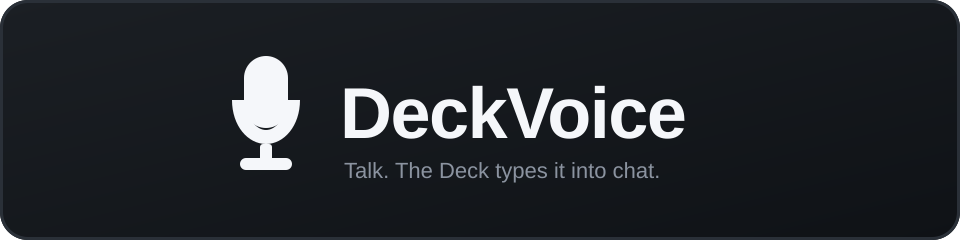

  

  <strong>Talk. The Deck types it into chat.</strong>

  
  
  
  
  

Hold a combo. Speak. Release. DeckVoice types into the focused game chat — no soft keyboard, no thumb-typing mid-raid.

In Warcraft, say the channel first: **party pull now** becomes `/p pull now`.

## Contents

- [Features](#features)
- [How it works](#how-it-works)
- [Profiles](#profiles)
- [Install](#install)
- [License](#license)

## Features

- **Push-to-talk** — hold a custom combo (default **L1 + R1**, up to 5 buttons)
- **On-screen overlay** — mic + level meter while you hold
- **Per-game profiles** — settings follow the running title; Enable only works in-game
- **World of Warcraft chat** — voice a channel, then the message
- **Multilingual channels** — party / пати / groupe / Gruppe / … across 15 languages
- **Generic profile** — plain typing for any other game
- **Model & language** — Tiny → Medium and auto-detect, all from QAM
- **Clean off switch** — Disable frees the Deck’s GPU for the game

## How it works

1. Launch a game in Game Mode
2. Open QAM → **DeckVoice** → **Enable**
3. Hold your trigger combo and talk
4. Release — the text lands in chat

First Enable downloads a speech model. After that it’s ready when you flip the switch.

## Profiles

### World of Warcraft

Say the channel, then the line:

| You say | Chat gets |
| --- | --- |
| `party ready` | `/p ready` |
| `raid stack on me` | `/raid stack on me` |
| `guild hello` | `/g hello` |
| `say looking for group` | `/s looking for group` |
| `yell pull!` | `/y pull!` |
| `whisper thanks` | `/w thanks` |

Also: officer, instance, alert, general, trade, LFG, and more. Channel words work in English, Russian, French, German, Spanish, and a dozen others.

### Generic

No slash commands — just your words, typed into whatever chat has focus. Good for everything that isn’t WoW.

## Install

Not in the Decky store yet. Sideload a build:

1. Install [Decky Loader](https://decky.xyz)
2. Grab the **DeckVoice** zip from the latest [GitHub Actions](https://github.com/neronmoon/DeckVoice/actions) run (artifact named `DeckVoice`)
3. Sideload the zip in Decky (Developer → Install plugin from ZIP, or your usual sideload path)

**Needs:** Steam Deck, Game Mode, Decky Loader.

## License

Plugin source is **MIT**. Bundled binaries and libraries are listed in [THIRD_PARTY_NOTICES.md](THIRD_PARTY_NOTICES.md).
